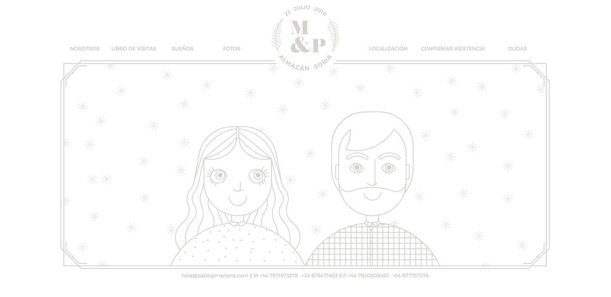
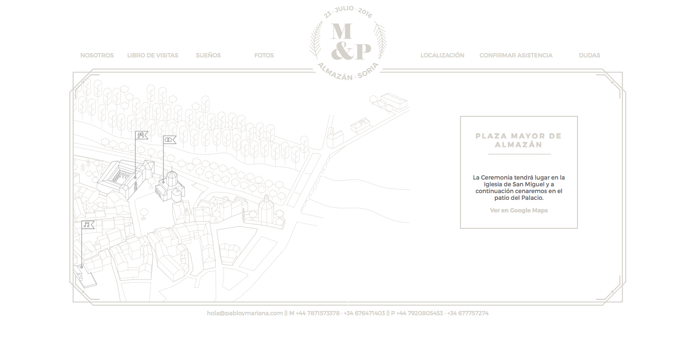
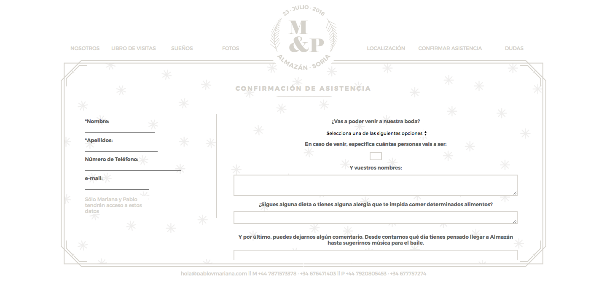

# My wed website.

Since I had already built [a website for a friend's wedding](https://github.com/marianalfr/a-website-for-a-wedding), I had to do it for mine as well. Unfortunately I lost the files for the final version, but I thought it would be nice to keep this WIP as a hint of what it was.

